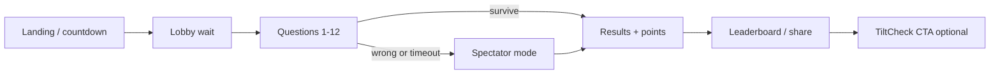
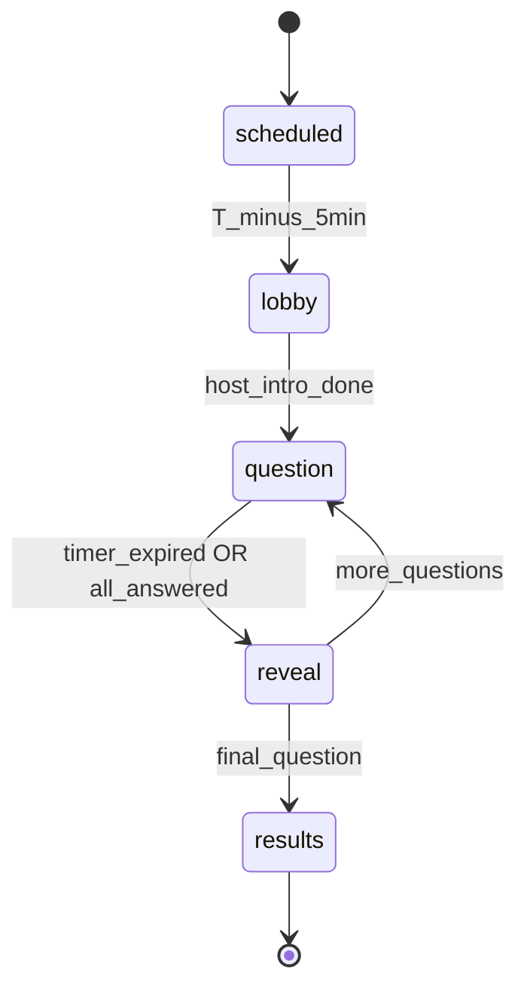
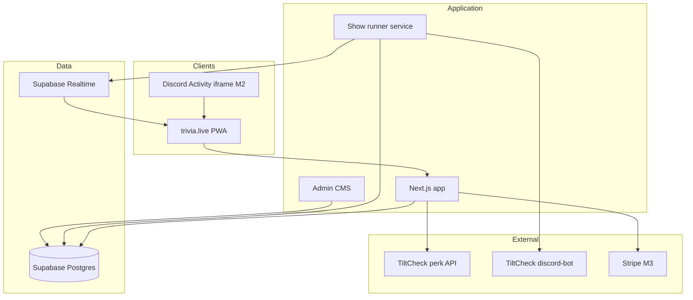
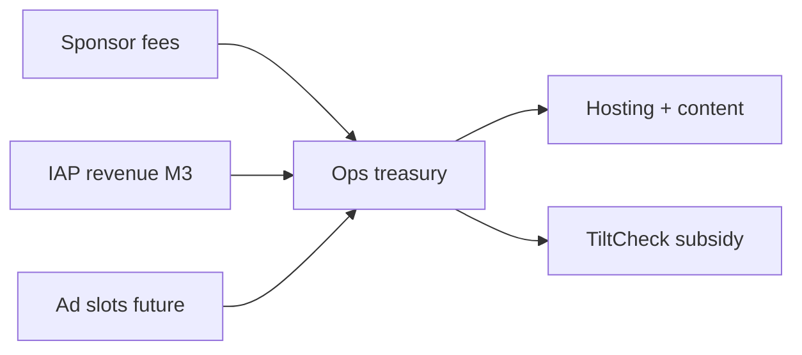

# trivia.live — Design Spec

**Status:** Approved (brainstorming)  
**Date:** 2026-06-17  
**Author:** jmenichole + Cursor brainstorm

---

## 1. Summary

**trivia.live** is an independent live trivia product inspired by HQ Trivia (2017–2020), but not affiliated with it. Players join scheduled shows in a browser, answer timed multiple-choice questions in elimination format, and earn **virtual points** — no cash prizes at launch.

The product is a **standalone mass-market brand** with a quiet ecosystem tie-in: TiltCheck Chrome extension users receive in-game perks (extra life, early lobby access). Revenue from sponsors and optional IAP subsidizes TiltCheck infrastructure so core gambling-defense tools stay free for intended users.

**Repo home:** `trivia.live` (this repository). Not Degens Against Decency — see §12.

---

## 2. Goals

### Primary goals

1. Ship a reliable, fun live trivia experience better than HQ on stability, pacing, and sustainable economics.
2. Grow a mass-market audience via `trivia.live` (general pop culture content).
3. Route surplus revenue to TiltCheck ops (hosting, Supabase, Discord bot).

### Non-goals (v1)

- Real-money or crypto prizes
- Native iOS/Android apps (deferred to M4)
- Live video host studio production
- Merging into Degens Against Decency or TiltCheck monorepo as the main codebase

### Success metrics (M1–M2)

| Metric | Target |
|--------|--------|
| Show completion rate | ≥ 80% of lobby players reach Q3 |
| Return players (7-day) | ≥ 25% of registered players play 2+ shows |
| Crash / stuck lobby rate | < 1% of shows |
| TiltCheck link rate | ≥ 10% of registered players link extension |

---

## 3. Product decisions (locked)

| Area | Decision |
|------|----------|
| **Positioning** | Hybrid — standalone trivia brand; TiltCheck perks for extension users |
| **Prizes** | Virtual points, badges, weekly leaderboards |
| **Format** | HQ elimination — wrong answer or timeout eliminates; extra lives save you |
| **Platform** | Web PWA at `trivia.live` (M1); Discord Activity shell (M2) |
| **Content** | General pop culture (movies, TV, sports, history, science, memes) |
| **Show length** | 10–12 questions, ~8–12 minutes |
| **Answer window** | 10 seconds, server-authoritative |
| **Schedule** | 1 show/day at launch (not HQ's 2× weekday cadence) |

---

## 4. User experience

### 4.1 Player journey



1. **Discover** — `trivia.live`, social share, Discord announcement (M2), web push (M2).
2. **Lobby** — countdown to show start; player count; optional chat (M2).
3. **Play** — question + 3 answers; 10s timer; elimination on miss unless extra life used.
4. **Spectate** — eliminated players watch remaining questions; earn small "stay tuned" points.
5. **Results** — points breakdown, rank, streak update, share card.
6. **Retain** — next show time, weekly leaderboard, TiltCheck perk reminder if unlinked.

### 4.2 Virtual rewards

**Points (per show):**

- Base: 100 × question difficulty (1–3) for correct answers
- Speed bonus: up to +50% based on time remaining
- Survival bonus: +500 for completing all questions
- Perfect show: +1000 bonus

**Meta progression:**

- Daily streak counter (consecutive show days played)
- Badges: first win, perfect show, top 10 weekly, 7-day streak, 30-day streak
- Weekly leaderboard reset (Monday 00:00 US Eastern)
- Profile flair unlocked by badges

Points have **no cash value**. Terms of service state entertainment-only.

### 4.3 Extra lives

| Rule | Value |
|------|-------|
| Max per show | 1 |
| Auto-use | On first wrong answer or timeout |
| Earn free | TiltCheck extension linked, referral, 3-day streak |
| Paid (M3) | Optional IAP; always earnable free |

### 4.4 TiltCheck perks

Requires linked Discord account + verified TiltCheck extension install.

| Perk | Detail |
|------|--------|
| Extra life | Grants the one allowed extra life for the show (same slot as streak/referral earn — not an additional life beyond the max) |
| Early lobby | Join 60 seconds before public lobby opens |
| Cosmetic (M2) | Profile border in trivia.live; optional dashboard flair in TiltCheck |

Perks are validated via TiltCheck perk API (see §8). Fail closed: if API unavailable, player gets standard rules (no perk).

### 4.5 Host presentation

M1 uses **pre-recorded host segments** (short intro, between-question banter clips, outro) — not a live video stream. Reduces cost and failure modes. Skip button for returning players after first viewing.

---

## 5. Show flow (state machine)

Server is authoritative for all transitions. Clients display state; they do not advance the game.



### States

| State | Duration | Server actions |
|-------|----------|----------------|
| `scheduled` | Until 5 min before | Accept registrations; early lobby for perk users |
| `lobby` | ~2–5 min | Countdown; emit player count |
| `question` | 10s + 2s buffer | Push question; collect answers; lock at deadline |
| `reveal` | ~3s | Show correct answer; eliminate; update survivors |
| `results` | ~30s | Compute points; persist; emit leaderboard slice |

### Elimination rules

- Unanswered when timer expires = wrong
- Wrong + no extra life → `eliminated`
- Wrong + extra life → consume life, remain active
- Eliminated players transition to spectator mode (receive questions read-only)

---

## 6. Architecture



### 6.1 Components

| Component | Responsibility |
|-----------|----------------|
| **Web PWA** | Player UI: lobby, questions, spectator, results, profile, leaderboard |
| **Show runner** | Cron-triggered worker; owns state machine; writes show events to DB + Realtime |
| **Question CMS** | Admin UI to create shows, attach question sets, schedule, preview |
| **Auth service** | Supabase Auth; Discord OAuth; guest sessions with upgrade path |
| **Perk bridge** | Calls TiltCheck API to verify extension; caches result 24h |
| **Anti-cheat (light)** | Server timestamps answers; reject late submissions; rate-limit per IP/account |
| **Discord Activity (M2)** | Same PWA in iframe; `@discord/embedded-app-sdk` for auth context |
| **Announce bridge (M2)** | Emits `trivia.started` on TiltCheck `event-router` for bot notifications |

### 6.2 Why not reuse Degens Against Decency as the codebase

DAD is a **party-game lobby** (3–7 players, user-created rooms, Socket.io per game). trivia.live is a **broadcast show** (thousands synced, scheduled, elimination). Different core engine, brand, and scale.

DAD remains a **pattern reference** for Discord Activity OAuth and a future **Degen Night** cross-promo surface — not the canonical repo. See §12.

### 6.3 Tech stack

| Layer | Choice | Rationale |
|-------|--------|-----------|
| Frontend | Next.js 15 App Router + PWA manifest | SSR for landing; aligns with TiltCheck web patterns |
| Realtime | Supabase Realtime (show channel per `show_id`) | Already in ecosystem; Postgres-backed |
| Database | Supabase Postgres | Auth + RLS + familiar from TiltCheck |
| Auth | Supabase Auth + Discord provider | Reuse OAuth patterns from `tiltcheck-monorepo/packages/supabase-auth` |
| Show runner | Supabase Edge Function or Node cron on Railway | Isolated from web request cycle |
| Hosting | Vercel (web) + Railway (worker) | Match existing deployment habits |
| Payments (M3) | Stripe Checkout for cosmetics | Manual sponsor invoicing until volume warrants |

---

## 7. Data model (core tables)

### `shows`

| Column | Type | Notes |
|--------|------|-------|
| id | uuid | PK |
| scheduled_at | timestamptz | Show start |
| status | enum | scheduled, lobby, live, completed, cancelled |
| current_state | jsonb | State machine snapshot |
| question_set_id | uuid | FK |
| sponsor_id | uuid | nullable |
| theme | text | e.g. `general`, `degen-night` (future) |

### `questions`

| Column | Type | Notes |
|--------|------|-------|
| id | uuid | PK |
| question_set_id | uuid | FK |
| order_index | int | 1–12 |
| body | text | |
| choices | jsonb | `[{id, text}]` × 3 |
| correct_choice_id | text | |
| difficulty | int | 1–3 |
| category | text | |

### `players` (profiles)

| Column | Type | Notes |
|--------|------|-------|
| id | uuid | PK, matches auth.users |
| display_name | text | |
| discord_id | text | nullable, unique |
| tiltcheck_linked_at | timestamptz | nullable |
| total_points | int | all-time |
| current_streak | int | days |

### `show_participants`

| Column | Type | Notes |
|--------|------|-------|
| show_id | uuid | |
| player_id | uuid | nullable for guests |
| guest_token | text | for anonymous |
| eliminated_at_question | int | null if survivor |
| extra_life_used | boolean | |
| points_earned | int | |

### `answers`

| Column | Type | Notes |
|--------|------|-------|
| show_id | uuid | |
| player_id | uuid | |
| question_index | int | |
| choice_id | text | |
| answered_at | timestamptz | server time |
| correct | boolean | |

RLS: players read own answers after reveal; show runner writes all.

---

## 8. Integrations

### 8.1 TiltCheck perk API

**Endpoint (TiltCheck side, to implement):** `GET /api/trivia/perks?discord_id=`

**Response:**

```json
{
  "has_extension": true,
  "extra_life_available": true,
  "early_lobby": true
}
```

trivia.live caches per player for 24 hours. On show join, perk bridge checks cache or API.

### 8.2 TiltCheck Discord bot (M2)

On show `lobby` → emit via event-router:

```json
{
  "event": "trivia.started",
  "data": {
    "theme": "General Pop Culture",
    "totalRounds": 12,
    "url": "https://trivia.live/show/{id}"
  }
}
```

Existing `trivia-notifier` in `tiltcheck-monorepo/apps/discord-bot` handles broadcast.

### 8.3 Discord Activity (M2)

- Separate Discord application or reuse TiltCheck app with `ActivityType.TRIVIA`
- Activity URL: `https://trivia.live/discord` (loads same client, activity mode flag)
- Reuse handshake patterns from Degens Against Decency (`POST /api/discord-activity/token` equivalent in trivia.live)

---

## 9. Monetization and TiltCheck funding



| Revenue stream | Phase | Notes |
|----------------|-------|-------|
| Sponsored show nights | M3 | Fixed fee per show; brand skin + sponsored category |
| Cosmetic IAP | M3 | Profile flair, emotes; no pay-to-win |
| Extra lives IAP | M3 | Must remain earnable free (legal + brand) |
| Display ads | Future | Only in spectator mode, never mid-question |

**Accounting rule:** sponsor revenue never funds virtual points liability (there is none). All sponsor fees are margin after hard costs.

**Transparency:** site footer — "Part of the TiltCheck ecosystem" with link. No gambling CTAs in main show flow.

---

## 10. Legal and compliance

- **Entertainment only** — ToS and in-app disclaimer; points have no monetary value.
- **No cash/crypto prizes** at launch — no 1099, no money transmission.
- **Age gate:** 13+ (Discord minimum) with 18+ recommendation in ToS for IAP (M3).
- **Paid extra lives (M3):** free earn path required (TiltCheck link, referral, streak) before IAP goes live.
- **Deferred:** sponsor gift cards require lawyer-reviewed official rules before implementation.

---

## 11. Phased delivery

| Phase | Scope | Exit criteria |
|-------|-------|---------------|
| **M0** | Design spec + implementation plan | This document approved |
| **M1 — Private alpha** | Web PWA, 1 show/day, CMS, virtual scoring, guest play | 50 internal players complete a show without desync |
| **M2 — Public beta** | Accounts, leaderboards, TiltCheck perks, Discord announces, Activity shell | 500 DAU peak; perk API live |
| **M3 — Monetization** | Stripe IAP, first sponsored show | Positive unit economics on one sponsor deal |
| **M4 — Mobile** | PWA polish (web push) or native shell | 30-day retention ≥ target |

---

## 12. Ecosystem map (related repos)

| Repo | Role |
|------|------|
| **trivia.live** (this) | Canonical product — scheduled live trivia |
| **tiltcheck-monorepo** | Perk API, discord-bot announcements, extension verification |
| **DegensAgainstDecency** | Party games in Discord VC; **not** trivia engine. Reference for Activity OAuth. Optional future "Degen Night" theme promoted to TiltCheck Discord only |
| **titantreasure** | Unrelated trivia ops (website-first); do not merge |

---

## 13. Better than HQ (explicit targets)

| HQ problem | trivia.live response |
|------------|---------------------|
| Capacity crashes | Server-authoritative state; load test 2× expected lobby; "show delayed" UX |
| Unsustainable cash prizes | Virtual points only; sponsors fund margin not payouts |
| Long host segments | 8–12 min shows; skip intro for returners |
| Lives only via IAP | Free earn via TiltCheck, referrals, streaks |
| Product died alone | Ecosystem funnel; TiltCheck subsidy loop |
| US-only content | Question packs; US launch, localize later |

---

## 14. Error handling

| Failure | Behavior |
|---------|----------|
| Show runner crash mid-show | Resume from `current_state` jsonb; if unrecoverable, cancel show + apology + bonus streak point |
| Realtime disconnect | Client reconnects to show channel; sync from last known question index |
| Perk API down | Play without perks; no error shown to user |
| Late answer submission | Reject silently; counts as timeout |
| CMS missing questions | Block show start; alert admin |

---

## 15. Testing strategy

| Layer | Approach |
|-------|----------|
| State machine | Unit tests for all transitions and elimination edge cases |
| Timer | Integration test: server clock drives 10s window; client cannot cheat |
| Load | Simulate 1k concurrent lobby connections before public beta |
| Perk bridge | Mock TiltCheck API; test cache TTL and fail-closed |
| E2E | Playwright: join lobby → answer 12 questions → see results |

---

## 16. Open items for implementation plan

1. Final choice: Supabase Edge Function vs Railway worker for show runner
2. Guest → registered account merge strategy (same show mid-play disallowed)
3. Chat moderation approach for M2 (slow mode, report, disable)
4. Question sourcing: manual CMS only vs AI-assisted draft (defer AI to post-M1)
5. Discord Activity: new Discord app vs extend TiltCheck app

---

## 17. Approval

| Reviewer | Status | Date |
|----------|--------|------|
| Product (jmenichole) | Approved via brainstorm | 2026-06-17 |

**Next step:** Invoke `writing-plans` skill to produce implementation plan from this spec.
