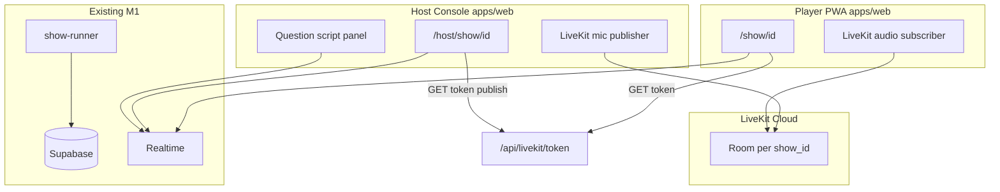

# trivia.live — Live Audio Host Design

**Status:** Draft for review  
**Date:** 2026-06-19  
**Parent spec:** [`2026-06-17-trivia-live-design.md`](./2026-06-17-trivia-live-design.md)  
**Author:** jmenichole + Cursor brainstorm

---

## 1. Summary

Add **optional live audio hosting** for scheduled shows: a human host reads questions aloud while players continue to use the existing elimination game on trivia.live. Text on screen and the server-authoritative 10-second timer remain the source of truth.

**Format:** Audio only (no live video).  
**Timing:** Parallel fixed — question text and timer start immediately; host audio is optional flavor.  
**Scheduling:** Manual toggle in admin when the host is available.  
**Infrastructure:** LiveKit sidecar — host publishes mic; players subscribe to audio on the show page.

Unhosted shows behave exactly as M1 (no audio component, no LiveKit).

---

## 2. Goals

### Primary goals

1. Let the product owner (or approved hosts) read questions live on some shows for HQ-style energy.
2. Keep the existing show runner, elimination logic, and fairness model unchanged.
3. Fail gracefully: if audio fails or host no-shows, the game still runs.

### Non-goals (v1)

- Live video / camera
- Host-triggered or host-gated timers
- Reading Discord chat on air
- Multiple simultaneous co-hosts
- Recording/host VOD replay distribution
- Replacing pre-recorded clip support (may add later; not required for v1)

---

## 3. Product decisions (locked)

| Area | Decision |
|------|----------|
| **Format** | Audio only |
| **Timer sync** | Parallel fixed — timer starts with question reveal; audio does not gate gameplay |
| **Activation** | Manual admin toggle per show (`host_mode: off \| live_audio`) |
| **Infrastructure** | LiveKit Cloud room per hosted show |
| **Source of truth** | On-screen question text + server timer (not host cadence) |

---

## 4. User experience

### 4.1 Admin / host

1. Schedule or edit a show in `/admin`.
2. Enable **Live audio host** toggle for that show.
3. Before show: open **Host Console** at `/host/show/[id]` (authenticated as host).
4. Grant microphone permission; verify audio meter / “You’re live” indicator.
5. During show: read current question from script panel as phases advance (same Realtime subscription as players).
6. Optional lobby banter and results sign-off on mic.
7. If unavailable: leave toggle off — show runs as normal M1.

### 4.2 Player

1. Landing or show page shows badge when `host_mode = live_audio` (e.g. “Live hosted tonight”).
2. On join, game UI unchanged for lobby / question / spectator / results.
3. **Audio strip** at top or bottom: “Tap to hear the host” (required once on mobile for autoplay policy).
4. After unmute: subscribe to LiveKit audio only (no video track).
5. If LiveKit unavailable or user keeps mute: play continues with text only.

### 4.3 Parallel fixed timing (explicit)

| Event | When |
|-------|------|
| Question text visible | `question` phase start (server) |
| Answer timer starts | `question` phase start (server) — 10 seconds |
| Host audio | Best-effort live read; may lag behind text without affecting fairness |

---

## 5. Architecture



### 5.1 Components

| Component | Responsibility |
|-----------|----------------|
| **Admin toggle** | Set `shows.host_mode` to `off` or `live_audio` |
| **Token API** | `GET /api/livekit/token?showId=&role=host\|player` — mint LiveKit JWT |
| **Host Console** | `/host/show/[id]` — script UI + mic publish |
| **Player audio strip** | Client component on show page when `host_mode = live_audio` |
| **Show runner** | No changes to phase timing |
| **LiveKit** | One room per show: `trivia-{show_id}` |

### 5.2 Auth & roles

| Role | Who | LiveKit grants |
|------|-----|----------------|
| **host** | User ID in `HOST_USER_IDS` or `ADMIN_USER_IDS` | `canPublish`, `canSubscribe` |
| **player** | Any joined participant (guest or auth) | `canSubscribe` only |

Token API validates:
- Host: session user in allowlist
- Player: valid `show_participants` row for `showId` (or open subscribe during lobby for hosted shows — see §8.2)

---

## 6. Data model changes

### `shows` table (migration)

| Column | Type | Notes |
|--------|------|-------|
| `host_mode` | text | `off` (default) or `live_audio` |
| `livekit_room` | text | nullable; default `trivia-{id}` when hosted |

No changes to `current_state`, `answers`, or game engine types.

---

## 7. API

### `GET /api/livekit/token`

**Query:** `showId` (uuid), `role` (`host` | `player`)

**Response:**
```json
{
  "token": "<jwt>",
  "url": "wss://<livekit-host>"
}
```

**Errors:**
- `403` — host role requested by non-host user
- `400` — show not in `live_audio` mode (players)
- `404` — show not found

**Env (Vercel):**
- `LIVEKIT_API_KEY`
- `LIVEKIT_API_SECRET`
- `LIVEKIT_URL` (e.g. `wss://your-project.livekit.cloud`)

Uses `livekit-server-sdk` to mint tokens server-side. Secrets never reach client except short-lived JWT.

---

## 8. Client integration

### 8.1 Dependencies

- `livekit-client` in `@trivia-live/web`
- `livekit-server-sdk` in `@trivia-live/web` (API route only)

### 8.2 Host Console (`/host/show/[id]`)

- Server: verify host allowlist; redirect otherwise
- Client:
  - `useShowChannel(showId)` — same hook as players
  - Display: phase, question index, question body, choices (for host reference only)
  - LiveKit: `Room`, publish local audio track
  - Status: connection state, mic level, “Live” badge

### 8.3 Player audio strip

- Render only when `show.host_mode === 'live_audio'`
- On user gesture: fetch player token, connect, subscribe to remote audio tracks
- `RoomAudioRenderer` or manual attach `<audio>` elements
- Disconnect on show `completed` / page leave

### 8.4 Mobile autoplay

- Initial state: muted / “Tap to hear host”
- Persist unmute preference in `sessionStorage` for show session
- Never block question UI behind audio permission

---

## 9. Failure modes

| Failure | Behavior |
|---------|----------|
| Host no-show | Game runs; players see hosted badge but no audio until host connects |
| Host disconnects mid-show | Audio drops; game continues |
| LiveKit outage | Token API returns 503; player strip shows “Host audio unavailable” |
| Host reads wrong line | Text on screen is canonical; no game impact |
| Player declines mic permission | N/A — players only subscribe, no publish permission needed |

---

## 10. Cost & ops (alpha)

- **LiveKit Cloud:** free tier ~50 GB/month; hosted shows at small concurrency fit alpha budget
- **Host prep:** Host Console question script removes need for printed run sheets
- **One show = one room;** room deleted or left to expire after `completed`

---

## 11. Phased delivery

| Phase | Scope |
|-------|--------|
| **H1** | Migration, admin toggle, token API, Host Console publish, player subscribe |
| **H2** | Hosted show badge on landing, audio UX polish, connection telemetry |
| **H3** | Optional: record host audio to storage for clip reuse (not live) |

H1 is a single implementation plan. Does not block M2 perks / Discord Activity.

---

## 12. Testing

| Layer | Approach |
|-------|----------|
| Token API | Unit test: host vs player claims; reject non-host publish |
| Host Console | Manual: two browsers — host publishes, player hears |
| Integration | Hosted show E2E: toggle on → join → unmute → verify track subscribed |
| Regression | Unhosted show: no LiveKit requests, M1 E2E unchanged |

---

## 13. Security

- LiveKit API secret only on server
- Player tokens scoped to room name + subscribe-only
- Host tokens scoped to room + publish; short TTL (e.g. 2 hours)
- Rate-limit token endpoint per IP

---

## 14. Alternatives considered

| Option | Why not primary |
|--------|-----------------|
| Discord Stage audio | Split app experience; kept as community fallback |
| Pre-recorded host packs | Not “live”; deferred |
| Host-triggered timer | Unfair + couples game engine to host; rejected |

---

## 15. Approval

| Reviewer | Status | Date |
|----------|--------|------|
| Product (jmenichole) | Approved approach (Option 1) | 2026-06-19 |

**Next step:** User review of this spec → `writing-plans` for H1 implementation plan.
